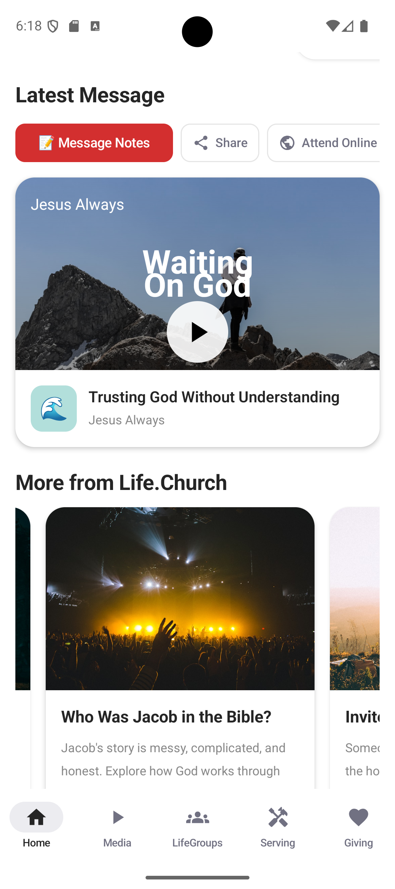

Name: Perry Ehimuh  
EID: pee279  
Email: perryehimuh@gmail.com  

---

# Life.Church App
Elegant and modern Android experience for Life.Church

---

## Overview
The Life.Church App is a high-performance, unofficial Android client built with Jetpack Compose.  
It provides a seamless experience for engaging with the community, watching services, and managing your giving.

The app is currently in active development. Contributions for improvements and bug fixes are welcome.

---

## Highlights
- Jetpack Compose Native UI  
- Dynamic Giving Experience (with Google Pay integration)  
- Location-Aware Campus Selection  
- Dark & Light Theme Support  
- Material 3 Design  
- Interactive Calendar for scheduling gifts  
- Real-time Campus Distance Calculation  
- Global & Local Missions Support  

---

## Screenshots

| Home Page | Giving Screen | Campus Selection |
|----------|-------------|-----------------|
|  |  |  |

---

## Features

### Smart Giving
Powered by Google Pay, the giving experience is designed to be frictionless.  
Whether it’s a one-time gift or a scheduled tithe, the app handles the complexity so you don't have to.

---

### Campus Locator
The app uses your GPS location (optional) to suggest the Life.Church campus closest to you.  
If you are traveling or out of state, it intelligently defaults to Life.Church Online.

---

### Giving Funds
Easily direct your generosity toward specific areas:
- **Tithe:** The first 10%  
- **New Locations:** Fueling growth  
- **Local & Global Missions:** Crisis relief  
- **YouVersion:** Sharing the Bible everywhere  

---

### Modern Navigation
A robust navigation system based on the web app’s route model, ensuring a consistent experience across platforms.

---

## Development

### Prerequisites
- Android Studio Iguana or newer  
- JDK 17  
- Android device or emulator with Google Play Services (for Google Pay testing)  

---

### Run
1. Clone the repository  
2. Open the project in Android Studio  
3. Sync Gradle  
4. Click **Run 'app'**  

---

### Build
To generate an APK or App Bundle:

```bash
./gradlew assembleDebug
```

---

## Technical Architecture
- **Language:** 100% Kotlin  
- **UI Framework:** Jetpack Compose (Material 3)  
- **Navigation:** Compose Navigation  
- **Image Loading:** Coil  
- **Payments:** Google Pay API (GMS Wallet)  
- **Location:** Google Play Services Location / LocationManager  

---

## Project Structure
- `ui/giving/` — Giving flows and payment logic  
- `ui/navigation/` — Route definitions and NavHost  
- `ui/theme/` — Material 3 design tokens and colors  

---

## Maintainers
- Perry (Lead Developer)

---

## Disclaimer
Life.Church App is a third-party application and is not officially affiliated with Life.Church Operations, LLC.
